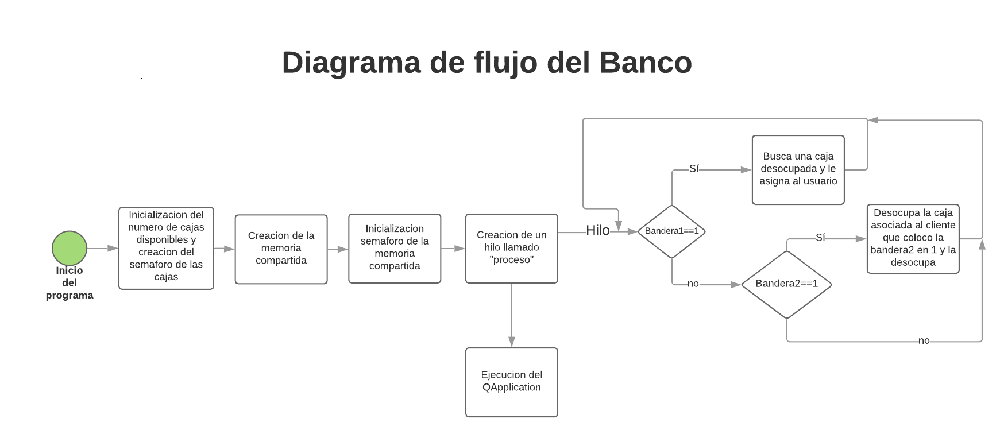
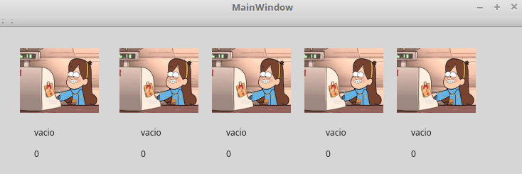

# Laboratorio 5 
# Sistemas Digitales III

### Presentado por:

- Carlos Fernando Guio Rodriguez
- Mario Alberto Segura Albarracin
- Nicolas Alzarez Casadiego

# Introduccion:
	
En este progama se busca coordinar y sincronizar lo que serian las cajas disponibles en un banco con la cantidad de clientes entrantes; se realiza una interfaz grafica en QT Creator en donde se muestran el numero de cajas disponibles (entre 1 y 10) y en cada una se muestra si esta disponible o los datos del cliente que esta atendiendo.
Los clientes son un proceso a parte en el que se accede a las cajas en caso de estar disponibles, en caso de no estarlo queda en espera hasta que una de ellas se desocupe. La sincronizacion se hizo mediante semaforos.

# Desarrollo del programa

El funcionamiento del programa se lleva a cabo en dos programas diferentes, el primero que es el del banco en donde se tienen en cuenta todas las funciones de las cajas y el programa del cliente que es donde se obtienen los datos del cliente y los datos respecto a este.

## Banco:

El desarrollo del banco se hizo de la siguiente forma:



Al ejecutar el programa se pide un argumento que es el numero de cajas que se activaran, "`./Banco #`", con este argumento se inicializa la interfaz grafica de del programa. 


(ejemplo con 5 cajas)
 
En este mismo proceso se inicializa el semaforo que se destinara a las cajas, `cajas = sem_open(name_shm, O_CREAT, 0644, num_cajas)` en esta seccion, **num_cajas** es el argumento que se recibe al ejecutar el programa y **name_shm** es el nombre de el semaforo que es "smp".

Despues de esto se crea la memoria compartida con el nombre "banco" y se le asigno la siguiente estructura:

```
typedef struct{//creamos una estructura la cual tendra los items de la memoria compartida
    int bandera1;
    int bandera2;
    int num_cajas;
    char nombre[81];
    int cedula;
    int caja_actual;
}item;
```


# Conclusiones:
	
- No fue posible inicializar los semaforos en la misma seccion de codigo, entre las multiples pruebas que se hicieron, la que mejor resulto fue inicializar un semaforo en la interfas del "mainwindow" y el otro semaforo en el "main".


	


