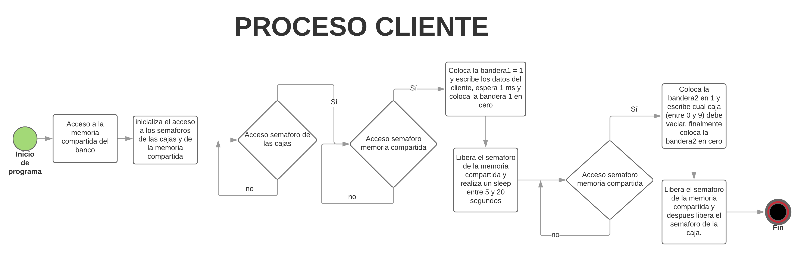
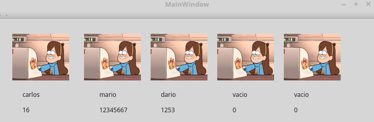

# Laboratorio 5 
# Sistemas Digitales III

### Presentado por:

- Carlos Fernando Guio Rodriguez
- Mario Alberto Segura Albarracin
- Nicolas Alzarez Casadiego

# Introduccion:
	
En este progama se busca coordinar y sincronizar lo que serian las cajas disponibles en un banco con la cantidad de clientes entrantes; se realiza una interfaz grafica en QT Creator en donde se muestran el numero de cajas disponibles (entre 1 y 10) y en cada una se muestra si esta disponible o los datos del cliente que esta atendiendo.
Los clientes son un proceso a parte en el que se accede a las cajas en caso de estar disponibles, en caso de no estarlo queda en espera hasta que una de ellas se desocupe. La sincronizacion se hizo mediante semaforos.

# Desarrollo del programa

El funcionamiento del programa se lleva a cabo en dos programas diferentes, el primero que es el del banco en donde se tienen en cuenta todas las funciones de las cajas y el programa del cliente que es donde se obtienen los datos del cliente y los datos respecto a este.

## Banco:

El desarrollo del banco se hizo de la siguiente forma:


Al ejecutar el programa se pide un argumento que es el numero de cajas que se activaran, "`./Banco #`", con este argumento se inicializa la interfaz grafica de del programa. 


(ejemplo con 5 cajas)
 
En este mismo proceso se inicializa el semaforo que se destinara a las cajas, `cajas = sem_open(name_shm, O_CREAT, 0644, num_cajas)` en esta seccion, **num_cajas** es el argumento que se recibe al ejecutar el programa y **name_shm** es el nombre de el semaforo que es "smp".

Despues de esto se crea la memoria compartida con el nombre "banco" y se le asigno la siguiente estructura:

```
typedef struct{

    int bandera1;
    int bandera2;
    int num_cajas;
    char nombre[81];
    int cedula;
    int caja_actual;
}item;
```

Depues de esto se inicializa el semaforo encargado del acceso a la memoria compartida el cual se inicializa con el valor de **1** ya que solo un cliente tiene acceso a la memoria compartida a la vez. 

Se inicializan las banderas bandera1 y bandera2 con 0 y se le asigna a num_cajas el argumento que se recibio desde la consola; despues de esto se crea un hilo que apunta a una funcion llamada **proceso** en la que se hace todo lo referente a lectura de banderas y mostrar los cambios en la interfaz grafica. Despues de crear el hilo el programa ejecuta la instruccion `return a.exec()` que se encarga de mostrar la interfaz grafica.

La funcion `proceso()` se muestra a continuacion:

```
while(true){
    if(datos_cliente->bandera1==1){
        for(int i=0;i<10;i++){
            if(cajas[i]==0){
                cajas[i]=1;
                datos_cliente->caja_actual=i;
                conta=i;
                i=10;
            }
        }
        usleep(100);
        a1=QString::number(datos_cliente->cedula);
        w->mostrar(datos_cliente->nombre,a1,conta);
        conta++;

    }else if(datos_cliente->bandera2==1){
        cajas[datos_cliente->caja_actual]=0;
        a1=QString::number(0);
        w->mostrar("vacio",a1,datos_cliente->caja_actual);
        datos_cliente->bandera2=0;
    }
}
```

Para controlar las cajas ocupadas y las cajas vacias fue necesario crear un arreglo de enteros de 10 posiciones, cada posicion simboliza una de las cajas en donde un **0** indica que la caja esta disponible y un **1** indica que la caja esta ocupada.


En esta seccion se revisan las dos banderas, la **bandera1** en 1 indica que un cliente quiere ingresar y que hay al menos una caja disponible y que coloco el nombre y la cedula en la memoria compartida, por lo tanto se revisa el arreglo de las cajas y se busca un **0** para que indica que la caja esta desocupada. En este caso se reemplaza el **0** por un **1** y se guarda la posicion del arreglo que se modifico en la memoria compartida en la variable **caja_actual** la cual se encarga de mostrarle lal cliente en que caja quedo para que despues sepa que caja puede liberar y finalmente se deja de buscar cajas vacias.

En este momento se lee de la memoria compartida el nombre y la cedula del cliente y se muestra en la interfaz grafica gracias a la funcion `w->mostrar(nombre, apellido, caja)` la cual recibe como parametros el nombre y la cedula del cliete y la caja que este va a ocupar.

La **bandera2** en 1 indica que el cliente acabo el proceso que tenia que realizar en la caja, por lo tanto, la caja queda desocupada. En este momento se lee de la memoria compartida la caja que se desocupo la cual esta guardada en la variable **caja_actual**, esta variable indica la posicion del arreglo que se cambiara a cero `cajas[datos_cliente->caja_actual]=0`, despues de esto se reemplaza el nombre del usuario por un **Vacio** y la cedula por un **0** para simbolizar que la caja esta desocupada, finalmente se resetea la bandera de la memoria compartida **bandera2** con un cero.

Los procesos antes descritos se realizan dentro de un `while(true)` para que el sistema este siempre pendiente de clientes entrantes o clientes que desocupan cajas. En este punto se ha explicado todo lo referente al proceso competente al banco, ahora se explicara el proceso del cliente.

## CLIENTE

En general, el proceso del cliente sigue el siguiente diagrama:



En el proceso del cliete es necesario recibir dos argumentos, el primero es el nombre del cliente y el segundo es el numero de cedula o identificacion con el que se identificara el cliente.

Despues de recibir los parametros del nombre e identificacion se procede a acceder a la memoria compartida y a los semaforos:

```
shm_fd = shm_open("banco",O_RDWR, 0666);
ptr = mmap(0, SIZE, PROT_WRITE|PROT_READ, MAP_SHARED, shm_fd, 0);
datos_cliente = (item*)ptr;

sem_t *cajas = sem_open(name_shm, O_CREAT);
sem_t *memoria = sem_open(name_sem, O_CREAT);

```

En esta seccion de codigo se realiza la sincronizacion necesaria, en este momento existen dos semaforos, el primero es el semaforo de **cajas** el cual tiene un valor de **num_cajas** que es el parametro con el que se inicializo el banco y que se compartio con el cliente por medio de la memoria compartida y el cual dejara que solo accedan **num_cajas** clientes al banco, el segundo semaforo es el de **memoria** el cual tiene un valor de **1** ya que solo un cliente tiene permitido ingresar a la memoria compartida.

```
sem_wait(cajas);

sem_wait(memoria);

usleep(1000);
datos_cliente->bandera1=1;
nombre=argv[1];
strcpy(datos_cliente->nombre,nombre);
datos_cliente->cedula = atoi(argv[2]);
caja_actual=datos_cliente->caja_actual;
printf("%d %s %d\n",caja_actual,datos_cliente->nombre,datos_cliente->cedula);
datos_cliente->bandera1=0;
sem_post(memoria);

int num = (5+rand()%(15))*1000000;
printf("Durara %d segundos\n",num/1000000);
usleep(num);

sem_wait(memoria);
datos_cliente->caja_actual=caja_actual;
datos_cliente->bandera2=1;

sem_post(memoria);

sem_post(cajas);
```

Cada cliente realiza una solicitud de `sem_wait(cajas)` en el que se verifican si existen cajas vacias, en caso de que no hayan cajas vacias se queda esperando hasta que alguien libere una caja con la funcion `sem_post(cajas)`, en caso de que haya una caja vacia procede realizar la solicitud a el semaforo de la memoria compartida con la funcion `sem_wait(memoria)`, en caso de que no pueda acceder debido a que un cliente este usando la memoria se queda esperando hasta que dicho cliente deje de usar la memoria con la funcion `sem_post(memoria)`, despues de esto el cliente procede a escribir la **bandera1** en 1 para  indicarle al programa del banco que se va a escribir el nombre y la cedula del cliente que esta accesando, de mismo modo se recibe el parametro de la caja que se esta usando por medio de la variable **caja_actual** de la memoria compartida. 

Despues de esto el cliente coloca la **bandera1** en 0 nuevamente para que el banco espere un nuevo cliente. En este momento el cliente genera un **sleep** aleatorio que dura entre 5 y 20 segundos, este tiempo representa un proceso normal que un cliente esta haciendo. despues de este tiempo de espera el cliente vuelve a realizar una solicitud de `sem_wait(memoria)` para escribir en la memoria compartida, cuando tenga acceso escribira la **bandera2** en 1 en la memoria compartida para indicarle al banco que acabo su proceso y que puede liberar la caja, el numero de la caja se escribe en la memoria compartida en la variable **caja_actual** para que le banco sepa que caja desocupar, despues de esto se realiza `sem_post(memoria)` y `sem_post(cajas)` para informar por medio del semaforo que se libero finalmente la memoria y la caja.

En este punto los dos programas han sido explicados, la interfalz grafica en funcionamiento se muestra a continuacion:



Se pueden ver tres cajas que estan ocupadas y dos disponobles, los programas se encuentran en el archivo de github, el programa del cliente se encuentra en la carpeta de **build-Banco-Unnamed-Debug** y el programa se llama **cliente_lab.cpp** y el programa del banco esta en la carpeta **Banco** y el proyecto es **Banco.pro** (abrir con QT Creator).


# Conclusiones:
	
- No fue posible inicializar los semaforos en la misma seccion de codigo, entre las multiples pruebas que se hicieron, la que mejor resulto fue inicializar un semaforo en la interfaz del **mainwindow** y el otro semaforo en el **main**.

- Para desarrollar el hilo se presentaron varios problemas, al principio se intento crear el hilo en el **mainwindow.cpp** pero nunca entraba a la funcion; la solucion que se encontro fue crear el hilo en el **main** y desde alli hacer todo.

- Al momento de usar los semaforos se presento el problema que no se accedia correctamente, esto se debia a que los permisos estaban mal, finalmente se logro un buen funcionamiento con los permisos **0644** que permiten leer y escribir en el semaforo y sus tokens.


	


